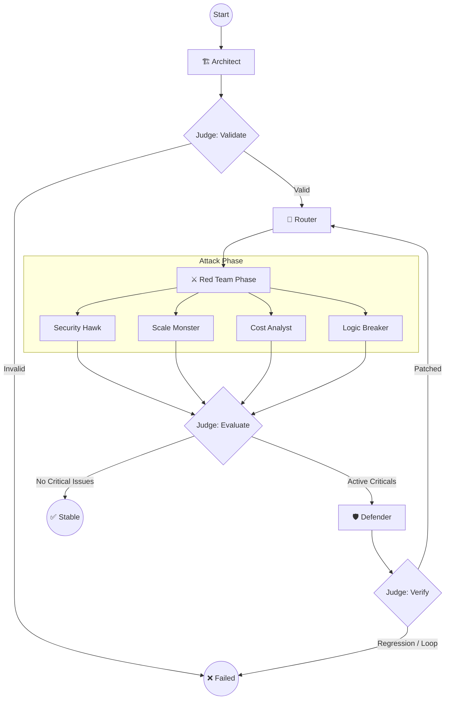

# 🏗️ AI Crucible Architecture

> "Civilization advances by extending the number of important operations which we can perform without thinking about them." — Alfred North Whitehead

The **AI Crucible** is not a chatbot. It is a **deterministic adversarial reasoning engine** built on [LangGraph](https://langchain-ai.github.io/langgraph/). It orchestrates a conflict between "Red Team" (Attacker) and "Blue Team" (Defender) agents to harden system designs before a single line of code is written.

---

## 🧠 System Overview

The Crucible operates as a **Finite State Machine (FSM)** with guarded transitions. Unlike conversational agents that can get stuck in loops or drift into hallucinations, the Crucible enforces a strict, observable control flow.

### Core Design Principles

1.  **Deterministic Control**: Agents cannot choose *what* to do next, only *how* to perform their assigned task. The graph defines the flow.
2.  **No Shared State**: Agents do not see each other's prompts. They communicate strictly through structured artifacts (`DesignComponent`, `Vulnerability`, `Patch`).
3.  **The Judge is King**: A non-LLM "Judge" component enforces invariants, validates schemas, and decides when to terminate the loop. Agents cannot override the Judge.
4.  **Graceful Degradation**: If a specialized agent fails (timeouts, schema errors), the system logs it and proceeds. The system is robust to partial failure.

---

## 🔄 The Control Loop

The system executes in iterations (Analysis → Attack → Patch → Evaluate).



### 1. Architect Node
*   **Role**: Generates the initial system design from the user's prompt.
*   **Constraint**: Must be "naive" (optimistic). It purely translates requirements into components without defensive pre-optimization, maximizing the surface area for the Red Team to find flaws.

### 2. Router Node
*   **Role**: Analyzes the design to decide which Red Team experts to activate.
*   **Logic**: Uses keyword heuristics (e.g., "SQL" triggers Security Hawk, "Queue" triggers Scale Monster).

### 3. Red Team Node (The Attackers)
Agents run in parallel (or sequentially if configured) to identify specific categories of risks.

| Agent | Domain | Target |
|-------|--------|--------|
| **Security Hawk** | `SECURITY` | Auth bypass, data leaks, injection, privilege escalation. |
| **Scale Monster** | `SCALABILITY` | Bottlenecks, race conditions, resource exhaustion, thundering herds. |
| **Cost Analyst** | `COST` | "Wallet-denial-of-service", expensive API loops, storage amplification. |
| **Logic Breaker** | `LOGIC` | State machine deadlocks, invalid transitions, distributed consensus failures. |

### 4. Defender Node
*   **Role**: Proposes minimal patches to fix specific vulnerabilities.
*   **Constraint**: Can only apply up to **3 patches** per iteration. This prevents "hallucinated refactors" where an agent claims to rewrite the whole system. The Defender must prioritize.

### 5. The Judge (Governance Overlay)
The Judge is the logic layer that binds everything together. It is **not** an agent.
*   **Novelty Detection**: Filters out duplicate vulnerabilities using semantic similarity embeddings.
*   **Regression Testing**: Ensures patches don't re-introduce old bugs.
*   **Termination Logic**: Decides when the system is `STABLE` (proof solid), `UNRESOLVED` (too complexities), or `FAILED` (error loop).

---

## 📂 Data Model

The system state is tracked in a Pydantic model (`CrucibleState`), ensuring type safety across the entire graph.

```python
class CrucibleState(BaseModel):
    user_prompt: str
    design_markdown: str
    design_components: List[DesignComponent]
    vulnerabilities: List[Vulnerability]
    patches: List[Patch]
    iteration_count: int
    status: Literal["ARCHITECTING", "UNDER_ATTACK", "PATCHING", "STABLE", "FAILED"]
    # ...
```

### Key Artifacts

*   **DesignComponent**: A specific part of the system (e.g., "User DB", "Payment Gateway") with defined responsibilities and assumptions.
*   **Vulnerability**: A structured finding with a title, description, severity (LOW/MED/HIGH/CRITICAL), and confidence score.
*   **Patch**: A proposed fix that targets a specific vulnerability ID.

---

## 🛠️ Technology Stack

*   **Orchestration**: [LangGraph](https://github.com/langchain-ai/langgraph)
*   **LLM Interface**: [LangChain](https://github.com/langchain-ai/langchain)
*   **Validation**: [Pydantic](https://docs.pydantic.dev/) for strict schema enforcement.
*   **Embeddings**: `sentence-transformers` for semantic deduplication.
*   **CLI**: `Typer` and `Rich` for the "War Room" interface.

---

## 🔮 Future Roadmap

*   **Docker Sandbox**: Allow Red Team agents to execute real code exploits in minimal containers.
*   **Graph Visualization**: Real-time browser-based rendering of the state machine.
*   **Human-in-the-Loop**: Interactive breakpoints where a human operator can guide the Defender.
