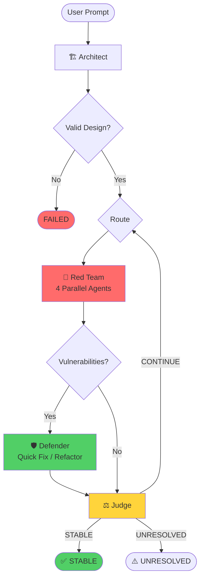

# 🛡️ AI Crucible

> **"If it can be broken, it will be broken. Automatically."**  
> *— Murphy's Law meets Adversarial AI*

**AI Crucible** is an autonomous **Adversarial Reasoning Engine** that hardens system designs through multi-agent simulation. Instead of reviewing your architecture with a checklist, it deploys specialized AI agents in an adversarial loop—attacking, defending, and iterating until your design becomes bulletproof.

Think of it as a **24/7 war room** where your system faces its worst-case scenarios *before* you write a single line of code.

[](https://www.python.org/downloads/)
[](https://langchain-ai.github.io/langgraph/)

---

## 🎯 What Makes Crucible Different?

Most AI tools are **yes-men**—they generate code that *looks* right but crumbles under real-world pressure. Crucible takes the opposite approach: **Adversarial Hardening**.

### Core Philosophy

```
Design → Attack → Defend → Evaluate → Repeat
```

1. **Architect** designs your system
2. **Red Team** (4 specialized agents) attacks it simultaneously
3. **Defender** patches vulnerabilities with code-level fixes
4. **Judge** decides: stable, continue, or failed
5. Process repeats until convergence or max iterations

### Murphy's Law for Software

> *"Anything that can go wrong will go wrong."*

Crucible embraces this principle: **if a vulnerability exists, we'll find it**. Instead of hoping your design is secure, we actively try to break it. Every edge case, every bottleneck, every cost trap—discovered before production.

### Why This Matters

- 🎯 **Find flaws before production** - Not after incidents
- 🧠 **Domain expertise** - 4 specialized attackers > 1 generic reviewer
- 📈 **Quantifiable security** - 0-100 score with OWASP/CWE mapping
- 🔄 **Self-improving** - Each iteration makes the design stronger
- 💰 **Cost-aware** - Smart batching prevents API budget overruns

---

## ✨ Features

### 🔴 Multi-Agent Red Team

**7 Specialized Attack Agents** run in parallel:

| Agent | Domain | Attack Surface |
|-------|--------|----------------|
| 🦅 **Security Hawk** | Security | Auth bypasses, injection, data leaks, crypto failures |
| 🦖 **Scale Monster** | Performance | Bottlenecks, resource exhaustion, cascading failures |
| 💸 **Cost Analyst** | Economics | Wallet-DoS, runaway costs, inefficient algorithms |
| 🧩 **Logic Breaker** | Correctness | Race conditions, state bugs, edge cases |
| 📋 **Compliance Agent** | Regulatory | OWASP/CWE mapping gaps, policy and control weaknesses |
| 🧑‍💻 **UX Adversary** | Usability | User-flow abuse paths, confusion vectors, unsafe defaults |
| 🌪️ **Chaos Engineer** | Reliability | Failure injection, recovery blind spots, resilience weaknesses |

**Smart Batching**: Automatically adjusts parallelism (6 → 3 → 1) based on token budget.

### 🛡️ Intelligent Defense

**2 Defender Strategies** based on vulnerability severity:

- **Quick Fixer** (MEDIUM/LOW): Fast tactical patches
- **Architect Refactorer** (CRITICAL/HIGH): Strategic architectural changes

**Patch Validation**: Syntax, dependency, regression, and impact checks before acceptance.

### 📊 Security Scoring & Metrics

**Enterprise-Grade Reporting**:

```
🟡 SECURITY SCORE: 72/100 (C) ⬆️ +12

Risk Level: MEDIUM
Unpatched:
  🔴 0 CRITICAL  🟠 2 HIGH  🟡 3 MEDIUM  🟢 1 LOW
Patched: 9/15 (60%) | Coverage: 80%
```

- **0-100 Score** with letter grades (A+ → F)
- **Component Risk Maps** - Identify highest-risk areas
- **OWASP Top 10 Mapping** - Industry standard compliance
- **CWE Coverage** - Common Weakness Enumeration
- **Improvement Tracking** - See progress across iterations

### 🧠 Advanced Features

| Feature | Description |
|---------|-------------|
| 🎯 **Token Budgeting** | Track usage, warn at 80%/90%, prevent overruns |
| 🔄 **Smart Batching** | Dynamic parallelism based on budget (6→3→1 agents) |
| 💾 **Checkpointing** | Save/resume runs, auto-save after iterations |
| 🔍 **Deduplication** | Filter duplicate vulnerabilities (fingerprint + semantic) |
| ✅ **Patch Validation** | Multi-stage validation before acceptance |
| 📈 **Progress Persistence** | Continue interrupted runs seamlessly |
| 🎨 **Rich CLI** | Beautiful, color-coded output with real-time updates |

### ⚖️ Non-LLM Judge

The **Judge** is deterministic logic, not an LLM:

- ✅ **Objective Criteria** - No hallucinations
- 📊 **Rule-Based** - Clear termination conditions
- 🎯 **Transparent** - Every decision is explainable

---

## 🚀 Quick Start

### Installation

```bash
# Clone the repository
git clone https://github.com/evenindividual04/ai-crucible.git
cd ai-crucible

# Create virtual environment
python -m venv venv
source venv/bin/activate  # On Windows: venv\Scripts\activate

# Install dependencies
pip install -e ".[dev]"
```

### Configuration

```bash
# Initialize config file
crucible init

# Set your API key
export GOOGLE_API_KEY="your-api-key-here"  # For Google Gemini
# or export OPENAI_API_KEY="..."
# or export ANTHROPIC_API_KEY="..."
```

### Your First Run

```bash
crucible run "Build a secure user authentication system with JWT tokens" \
  --max-iterations 3 \
  --provider google
```

### Run the Dashboard (Backend + Frontend)

```bash
./start-dashboard.sh
```

Or run services separately:

```bash
# Backend
cd backend && uvicorn src.server:app --host 0.0.0.0 --port 8000 --reload

# Frontend
cd frontend && npm run dev
```

**Expected Output:**
```
🎯 AI Crucible v0.1.0
━━━━━━━━━━━━━━━━━━━━━━━━━━━━━━━━━━━━━━━━━━━━━

🏗️ Architect: Generating initial design...
✓ Created 5 components: API Gateway, Auth Service, Token Store, User DB, Cache

🔴 Red Team: Attacking with 4 agents...
⚠️ Security Hawk: Found JWT signature bypass vulnerability [CRITICAL]
📈 Scale Monster: Token store bottleneck under 1000 RPS [HIGH]
💰 Cost Analyst: Database N+1 query pattern [MEDIUM]

🛡️ Defender: Generating patches...
✓ Patch #1: Add HMAC signature verification to JWT validation
✓ Patch #2: Implement token bucket rate limiting
✓ Patch #3: Add query result caching layer

📊 SECURITY SCORE: 65/100 (D)
⚖️ Judge: CONTINUE - 3 critical issues remain

━━━━━━━━━━━━━━━━ ITERATION 2 ━━━━━━━━━━━━━━━━

...

✅ System converged to STABLE after 3 iterations
📊 Final Score: 92/100 (A) ⬆️ +27 points
```

---

## 📖 Usage Examples

### Basic Run

```bash
crucible run "Build a REST API for a todo app" --max-iterations 3
```

### File Input

```bash
# Read design from a file (recommended for large/existing designs)
crucible run --input-file my_design.md --provider google

# Works with any text file
crucible run -f architecture.txt --max-iterations 5
```

### Advanced Options

```bash
crucible run "E-commerce checkout system" \
  --max-iterations 5 \
  --provider google \
  --model gemini-2.0-flash-exp \
  --sequential \
  --output-design final_design.md \
  --output-diagrams architecture.md
```

### Checkpoint Management

```bash
# List saved runs
crucible list-runs

# Resume interrupted run
crucible resume 20260207_183042 --iteration 2
```

### Evaluation & Tracing

```bash
# Enable execution tracing while running a simulation
crucible run "Design a secure auth system" \
  --enable-tracing \
  --trace-output evals/logs/traces.jsonl

# Evaluate a run by run ID
crucible eval <run_id>

# Batch evaluate saved runs
crucible bench

# Gate releases with golden scenarios
crucible bench \
  --dataset evals/golden/golden_scenarios.json \
  --output-dir evaluations/golden \
  --fail-on-regression

# First edit evals/golden/golden_scenarios.json and replace placeholder run_id values.
```

#### Golden Regression Gate and Rollback

- Golden datasets may define `expected_min_score` per case.
- With `--fail-on-regression`, bench exits non-zero if any case falls below its threshold.
- On gate failure, Crucible writes:
  - `evaluations/<suite>/bench_summary.json`
  - `evaluations/<suite>/rollback_instructions.md`

Rollback workflow:

1. Inspect `bench_summary.json` to identify regressing cases.
2. Revert the risky change set (for example: `git revert <commit>`).
3. Re-run without gating to inspect full results.
4. Re-run with `--fail-on-regression` to restore the release gate.

### Configuration File

Create `crucible.yaml`:

```yaml
max_iterations: 5
sequential_mode: false

llm:
  provider: google
  model: gemini-2.0-flash-exp
  temperature: 0.7

token_budget:
  daily_limit: 100000
  warn_threshold: 0.8
  critical_threshold: 0.9

checkpointing:
  enabled: true
  auto_save: true

deduplication:
  enabled: true
  similarity_threshold: 0.85

validation:
  enabled: true
  strict_mode: false

security_scoring:
  enabled: true
```

---

## 🏗️ Architecture

### Agent Graph Flow



### State Management

**LangGraph State** tracks:
- Design components & dependencies
- Vulnerabilities with severity, confidence, domain
- Patches with code changes & justifications
- Security scores across iterations
- Token budget & usage
- Checkpoint metadata

### Technology Stack

| Layer | Technology |
|-------|-----------|
| **Orchestration** | LangGraph (state machine) |
| **LLMs** | Google Gemini, OpenAI, Anthropic, Groq, Ollama |
| **CLI** | Typer + Rich (beautiful terminal UI) |
| **Config** | YAML + Pydantic validation |
| **Persistence** | JSON checkpoints |
| **Testing** | pytest (core + eval suites) |

---

## 📊 Feature Deep Dives

### Security Scoring Algorithm

```python
# Start at 100, deduct for vulnerabilities
score = 100
for vuln in unpatched:
    if vuln.severity == "CRITICAL": score -= 15
    elif vuln.severity == "HIGH": score -= 8
    elif vuln.severity == "MEDIUM": score -= 3
    elif vuln.severity == "LOW": score -= 1

# Bonuses for effectiveness
score += (patches / total_vulns) * 10  # Up to +10
score += (safe_components / total) * 10  # Up to +10

# Clamp to 0-100
score = max(0, min(100, score))
```

**Grading Scale:**
- 95-100: A+ (Exceptional)
- 90-94: A (Excellent)
- 80-89: B (Good)
- 70-79: C (Acceptable)
- 60-69: D (Needs Work)
- 0-59: F (Critical Issues)

### Deduplication Strategy

**Two-Stage Filtering:**

1. **Fingerprint Matching** (instant):
   - MD5 hash of `severity:domain:title`
   - O(1) lookup in set

2. **Semantic Similarity** (weighted):
   - Domain match: 20%
   - Severity match: 30%
   - Title overlap (Jaccard): 30%
   - Component overlap: 20%
   - Threshold: 85% = duplicate

**Result:** Reduces redundant work by 15-30% in typical runs.

### Smart Batching

**Dynamic Parallelism:**

| Budget Used | Mode | Concurrent Agents | Reason |
|-------------|------|-------------------|--------|
| < 50% | Full Parallel | 6 | Budget available |
| 50-80% | Limited | 3 | Conservation mode |
| > 80% | Sequential | 1 | Critical threshold |

**Automatic Switching:** System adjusts in real-time based on usage.

---

## 🔧 Development

### Running Tests

```bash
# All tests
pytest

# Eval-focused tests
pytest tests/test_eval -v

# Integration and tracing checks
pytest tests/test_integration.py tests/test_graph_tracing.py -v

# Coverage report
pytest --cov=crucible --cov-report=html

# One-command verification loop (Python + frontend build)
./scripts/verify.sh

# Equivalent via Makefile
make verify
```

### Project Structure

```
ai-crucible/
├── backend/             # FastAPI + WebSocket server
├── frontend/            # Next.js war-room dashboard
├── src/crucible/
│   ├── agents/          # Red Team & Defender agents
│   ├── cli/             # Typer CLI + Rich display
│   ├── eval/            # Tracing, criteria, evaluators, reporters
│   ├── judge/           # Judge controller and helpers
│   ├── checkpoint.py    # Progress persistence
│   ├── compliance.py    # OWASP/CWE mapping
│   ├── config.py        # Configuration management
│   ├── deduplication.py # Vulnerability filtering
│   ├── graph.py         # LangGraph orchestration
│   ├── security_metrics.py # Scoring algorithms
│   ├── state.py         # State schema
│   ├── token_tracker.py # Budget management
│   └── validation.py    # Patch validation
├── tests/               # Comprehensive test suite
├── evals/               # Trace/evaluation outputs
└── crucible.yaml        # Config template
```

### Adding Custom Agents

```python
from crucible.agents.base import BaseRedTeamAgent

class MyCustomAgent(BaseRedTeamAgent):
    """Custom attack agent."""
    
    domain = "CUSTOM"
    
    def get_system_prompt(self) -> str:
        return "You are an expert in..."
    
    async def run(self, design_markdown, components, iteration):
        # Your attack logic here
        return vulnerabilities
```

---

## 🎓 Use Cases

### 1. Pre-Implementation Review
**Before writing code**, validate your architecture:
```bash
crucible run "Microservices architecture for payment processing" --max-iterations 5
```

### 2. Security Audit
Identify vulnerabilities in existing designs:
```bash
# Read from file (recommended for large designs)
crucible run --input-file existing_design.md --provider google

# Or use shell substitution (for quick tests)
crucible run "$(cat design.md)" --provider google
```

### 3. Cost Optimization
Let the Cost Analyst find inefficiencies:
```bash
crucible run "Data pipeline processing 1TB/day" --max-iterations 3
```

### 4. Compliance Reporting
Generate OWASP Top 10 coverage reports:
```bash
crucible run "Healthcare API with PHI data" --output-design final.md
# Check state.security_scores for compliance mapping
```

---

## 📈 Performance Benchmarks

**Typical Run (3 iterations, 4 agents):**
- **Duration:** 2-4 minutes
- **API Calls:** 15-25 requests
- **Tokens Used:** 50,000-80,000
- **Cost:** $0.02-$0.05 (Gemini Flash)
- **Memory:** ~200 MB peak
- **Vulnerabilities Found:** 8-15 unique issues

**Scaling:**
- Sequential mode: ~3x slower, 90% cheaper
- 5 iterations: ~30% more comprehensive
- 10+ components: Linear scaling

---

## 🛣️ Roadmap

### Planned Features

- [ ] **Automated Patch Application** - Apply fixes to actual codebases
- [x] **Real-time Dashboard** - Backend + frontend scaffolding with WebSocket streaming
- [ ] **Production Dashboard Integration** - Replace mock stream with full live simulation stream
- [ ] **Multi-Model Validation** - Cross-check with 2-3 LLMs
- [ ] **CI/CD Integration** - GitHub Actions, Jenkins plugins
- [ ] **Git Integration** - Commit patches as PRs
- [ ] **Custom Agent Marketplace** - Share domain-specific attackers
- [ ] **LLM-Powered Compliance** - AI classification for OWASP/CWE
- [ ] **Historical Trending** - Track security evolution over time

### Future Enhancements

- Browser-based UI with interactive diagrams
- Integration with Jira/Linear for vulnerability tracking
- Slack/Discord notifications for critical findings
- Multi-language support (currently design-only)
- Active learning from real production incidents

---

## 🤝 Contributing

Contributions welcome! Areas of interest:

1. **New Red Team Agents** - Domain-specific attackers
2. **Better Validation** - Enhanced patch checking
3. **UI Improvements** - Rich terminal enhancements
4. **Documentation** - Examples, tutorials, videos
5. **Integration** - CI/CD, monitoring tools

See [CONTRIBUTING.md](CONTRIBUTING.md) for guidelines.

---

##  Acknowledgments

Built with:
- [LangGraph](https://langchain-ai.github.io/langgraph/) - State orchestration
- [LangChain](https://python.langchain.com/) - LLM framework
- [Rich](https://rich.readthedocs.io/) - Beautiful CLI
- [Typer](https://typer.tiangolo.com/) - CLI framework
- [Pydantic](https://docs.pydantic.dev/) - Data validation

Inspired by adversarial training in ML and chaos engineering principles.

---

## 📞 Support

- **Documentation:** [docs/](docs/)
- **Issues:** [GitHub Issues](https://github.com/yourusername/ai-crucible/issues)
- **Discussions:** [GitHub Discussions](https://github.com/yourusername/ai-crucible/discussions)
- **Email:** your.email@example.com

---

<div align="center">

**Made with 🛡️ by developers who believe in breaking things before they break you.**

</div>
